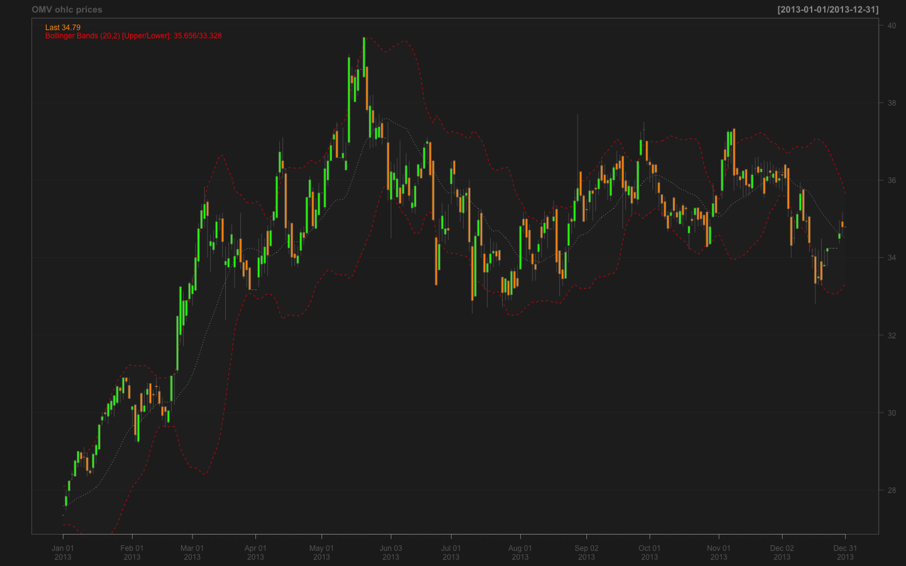

Timeseries basics  
========================================================
author: Walter Djuric
type: title  
font-family: 'Arial'
date: 03/03/2015  
autosize: true 

   

*** 
**ViennaR - Meetup 2015/I**  
***

***  

Word from one of our Sponsors 
========================================================


Overview
========================================================
type:prompt 
width: 1440
height: 900

- timeseries (ts, zoo/xts)  
- basic stuff (create, plot)  
- financial data     

Timeseries basics and packages 
========================================================
type: section 

For an overview of available packages ...  
see CRAN task view:   
http://cran.r-project.org/web/views/TimeSeries.html 

We will have a quick look at: 
- base R `ts` objects 
- `zoo` & `xts` class/package and their use for     
- financial timeseries  

Timeseries in base R 
========================================================
is an array of values (the data) paired with an ordering index (usually time). 

Base R timeseries object: 

- ts 

```r
(z <- ts(1:10, frequency = 4, start = c(2013, 2))) 
```

```
     Qtr1 Qtr2 Qtr3 Qtr4
2013         1    2    3
2014    4    5    6    7
2015    8    9   10     
```

Multiple timeseries 
========================================================

```r
head(dat <- matrix(rnorm(48), 12,3), n = 3) # the data 
```

```
           [,1]       [,2]       [,3]
[1,] -0.1795944 -0.7332891  0.9740385
[2,]  0.3152956 -0.4031446 -0.4513895
[3,]  1.3721964 -0.3035223 -0.1567037
```

```r
mz <- ts(dat, start = c(2010, 1), end = c(2013,12), frequency = 12)
.preformat.ts(mz)[1:3,] 
```

```
           Series 1   Series 2   Series 3
Jan 2010 -0.1795944 -0.7332891  0.9740385
Feb 2010  0.3152956 -0.4031446 -0.4513895
Mar 2010  1.3721964 -0.3035223 -0.1567037
```

plot.ts 
========================================================

```r
plot(mz, lty=1:3, plot.type = "single") 
```


In need of new class(es)/package(s)   
========================================================
type: subsection 

The weakness of base R timeseries class lies in the limited scope of its methods.   
So some folks (A. Zeiles, G. Grothendieck, J. A. Ryan, J. M. Ulrich) decided to build package(s). 
  
**zoo** and **xts** ended up as much more powerful alternatives with respect to available methods etc.  to base R `ts`.   
So let's have a look. 


zoo & xts 
========================================================
type: section  

**xts** is a superset of the **zoo** package i.e. xts can do everything that zoo can do!  
Details are available in the package vignette ...   


```r
require(xts)  
#vignette("xts")  
```

========================================================
type: subsection  

```r
x <- 1:10; dt <- Sys.Date()+c(1:10)
ts <- xts(x, dt)
class(ts)
```

```
[1] "xts" "zoo"
```
The data `x` is epxected to be `numeric`.  
The time vector (or index) `dt` must be a supported date or time class: `Date, POSIXct, chron`. 

Multi-column data
========================================================
type: subsection  


```r
data(sample_matrix)  
head(sample_matrix, 3)
```

```
               Open     High      Low    Close
2007-01-02 50.03978 50.11778 49.95041 50.11778
2007-01-03 50.23050 50.42188 50.23050 50.39767
2007-01-04 50.42096 50.42096 50.26414 50.33236
```

```r
class(sample_matrix)
```

```
[1] "matrix"
```

========================================================
type: subsection  
#incremental: true


```r
str(sample_matrix)
```

```
 num [1:180, 1:4] 50 50.2 50.4 50.4 50.2 ...
 - attr(*, "dimnames")=List of 2
  ..$ : chr [1:180] "2007-01-02" "2007-01-03" "2007-01-04" "2007-01-05" ...
  ..$ : chr [1:4] "Open" "High" "Low" "Close"
```


```r
xts_mtx <- as.xts(sample_matrix, descr = 'new xts obj')  
```

========================================================
type: subsection  


```r
str(xts_mtx)
```

```
An 'xts' object on 2007-01-02/2007-06-30 containing:
  Data: num [1:180, 1:4] 50 50.2 50.4 50.4 50.2 ...
 - attr(*, "dimnames")=List of 2
  ..$ : NULL
  ..$ : chr [1:4] "Open" "High" "Low" "Close"
  Indexed by objects of class: [POSIXct,POSIXt] TZ: 
  xts Attributes:  
List of 1
 $ descr: chr "new xts obj"
```

Plotting timeseries 
========================================================
type: subsection 

> Simple xts  plot   


 "Simple chart plot"

*** 
> Fancy xts plot 


 "Candle stick chart"

Financial timeseries  
========================================================
type: section   

Main packages ...  
see CRAN task view:  
http://cran.r-project.org/web/views/Finance.html   

Finally we will have a closer look into the **quantmod** package  as well. 

quantmod 
========================================================
type: subsection 
title: false 


```r
library(quantmod) 
OMV <- getSymbols("OMV.VI", auto.assign = FALSE) #make sure internet connection is available 
```


```r
class(OMV)
```

```
[1] "xts" "zoo"
```

========================================================
type: subsection 


```r
tail(OMV, 3)
```

```
           OMV.VI.Open OMV.VI.High OMV.VI.Low OMV.VI.Close OMV.VI.Volume
2015-03-11       24.89       24.94      24.40        24.67        571900
2015-03-12       24.67       25.04      24.67        24.86        421100
2015-03-13       24.95       24.95      24.11        24.34        474600
           OMV.VI.Adjusted
2015-03-11           24.67
2015-03-12           24.86
2015-03-13           24.34
```

quantmod plot 
========================================================
type: subsection 


```r
png(filename = "./figures/OMV_chart.png", width=1440, height=900)
chartSeries(OMV, subset="2013::2013", 
            name = "OMV ohlc prices", 
            show.grid = TRUE,  
            minor.ticks = TRUE,  
            color.vol = TRUE)  
```

quantmod plot cont'd
========================================================
type: subsection 


Add an Indicator (e.g. Boillinger Bands)
========================================================
type: subsection





TTR for quantmod 
========================================================
type: section 


```r
library(TTR)
```


`quantmod` depends on `TTR` - which provides numerous indicators that can be added to our plots e.g.:  

- Moving Averages (SMA, EMA, etc.)
- RSI 
- MACD 
- Stochastics 
- Stock symbols 
- etc.  

Add more indicators 
========================================================
type: subsection  


 "add some indicator"

***


Last (not least) a ggplot2 graph
========================================================
type: subsection  


```r
#Create prices and volumes  
df <- OMV[ , c("OMV.VI.Adjusted", "OMV.VI.Volume")]
names(df) <- c("price", "vol")
#Create return col 
df$ret <- diff(log(df[ , 1]))
df <- df[-1, ]#loose the first data-point as return is NA  
head(df, 4)
```

```
           price     vol          ret
2007-01-02 34.42  456000  0.007582422
2007-01-03 34.13  924300 -0.008461028
2007-01-04 33.30 1180800 -0.024619366
2007-01-05 32.42 1061200 -0.026781881
```

ggplot2 cont'd 
========================================================
type: subsection  

Define return buckets - we utilize the `cut` function for that   

```r
df$bucket <- cut(abs(df$ret), breaks = c(0, 0.03, 0.06, 0.25), 
                  include.lowest = TRUE) 
#Add mean column 
df$avg <- NA 
for ( i in 1:3 ) {
  group <- which( df$bucket == i ) 
  if ( length(group) > 0 ) {
    df$avg[group] <- mean(df$vol[group])
  }
} 
```

========================================================
type: subsection  


```
ggplot(df) + geom_histogram(aes(x=vol)) + facet_grid(bucket ~ .) + geom_vline(aes(xintercept = avg), ... 
```


Thank you!  
========================================================
type: prompt 

Hope to see you (again) at the next Meetup!  


```
quartz_off_screen 
                3 
```


